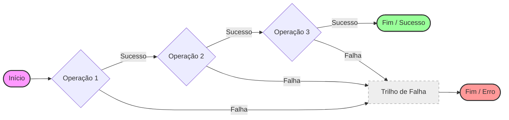

# Tratamento Funcional de Erros e o Padrão Result

Este documento descreve a filosofia e a arquitetura por trás do tratamento de erros no projeto, movendo-se além do paradigma imperativo de exceções para uma abordagem funcional e determinística conhecida como **Railway Oriented Programming**.

---

## 1. O Problema das Exceções Tradicionais

Em sistemas complexos, o uso de `Exceptions` para controle de fluxo de negócio apresenta diversos desafios:

1.  **Gotos Invisíveis**: Exceções criam saltos na execução que não são evidentes na assinatura dos métodos, tornando o fluxo de código difícil de seguir.
2.  **Abordagem Parcial**: Uma função que lança uma exceção é uma "função parcial" — ela não retorna um valor para todas as entradas possíveis, o que reduz a previsibilidade.
3.  **Acoplamento**: Capturar exceções específicas exige que camadas superiores conheçam detalhes de implementação das camadas inferiores.
4.  **Performance**: O custo de capturar o *stack trace* é significativo em fluxos de alta concorrência.

## 2. Conceito Central: Railway Oriented Programming (ROP)

O Padrão Result visualiza a lógica de negócio como um "trilho de trem". No cenário ideal, os dados fluem pelo **Trilho do Sucesso**. Quando algo dá errado, o trem é desviado para o **Trilho da Falha**.

### Diagrama de Fluxo (Railway)



Uma vez que o fluxo entra no trilho da falha, as operações subsequentes de sucesso são ignoradas automaticamente, e o erro é propagado até a fronteira do sistema.

---

## 3. A Abstração Result

Em vez de métodos que retornam `T` ou lançam `Exception`, utilizamos o tipo `Result<T, E>` onde `T` é o tipo esperado e `E` é o tipo de erro. Este tipo é uma **Mônada** que encapsula o estado da operação.

### Composição e Transformação

A força deste padrão não está apenas em verificar `isSuccess()`, mas em compor operações:

*   **Transformação (Map)**: Aplica uma função ao valor de sucesso, mantendo o erro se já existir.
*   **Encadeamento (FlatMap/Chain)**: Conecta duas operações que retornam `Result`, permitindo que o erro de qualquer uma interrompa o fluxo.
*   **Recuperação (Recover)**: Permite transformar um erro em um valor de sucesso (útil para valores padrão).

---

## 4. Integração com a Arquitetura Hexagonal

O tratamento funcional de erros é um pilar estratégico na manutenção das fronteiras do hexágono.

### No Domínio (Core)
O domínio define seus próprios **Erros de Domínio**. Estes são objetos de valor que descrevem *o que* deu errado sem expor detalhes técnicos.
*   *Exemplo*: `UserAlreadyExists`, `InsufficientFunds`, `ProjectExpired`.

### Nos Ports
As assinaturas dos Ports deixam claro os resultados possíveis. Não há surpresas.
```java
// Contrato explícito
Result<Project, String> createProject(CreateProjectCommand command);
```

### Nos Adapters (Edge)
Os Adapters de Entrada (REST/Web) são responsáveis pela **Tradução Final**. Eles recebem um `Result` e decidem o mecanismo de entrega:
- **REST**: Traduz `NotFoundError` para HTTP 404.
- **Web (Thymeleaf)**: Traduz `ValidationError` para mensagens de erro no formulário.
- **CLI**: Traduz o erro para um código de saída (exit code) e mensagem no `stderr`.

---

## 5. Benefícios Arquiteturais

1.  **Segurança de Compilação**: O compilador força o desenvolvedor a lidar com o cenário de erro.
2.  **Documentação Viva**: A assinatura do método revela todos os resultados possíveis.
3.  **Código Declarativo**: O código foca no "o que" está sendo feito (o caminho feliz) enquanto o "como" tratar o erro é gerenciado pela estrutura do `Result`.
4.  **Testabilidade**: É extremamente simples testar fluxos de erro sem precisar configurar mocks complexos para lançar exceções.

---

> [!TIP]
> **Totalidade de Funções**: Busque sempre criar "Total Functions". Se uma função pode falhar, ela deve retornar o erro como parte do seu tipo de retorno. Isso remove a ambiguidade e torna o sistema robusto contra falhas inesperadas.

> [!IMPORTANT]
> O padrão Result não deve ser usado para erros fatais de infraestrutura (ex: OutOfMemory, StackOverflow). Para esses casos, as exceções de runtime do Java continuam sendo a ferramenta apropriada, pois representam uma parada catastrófica do sistema.
